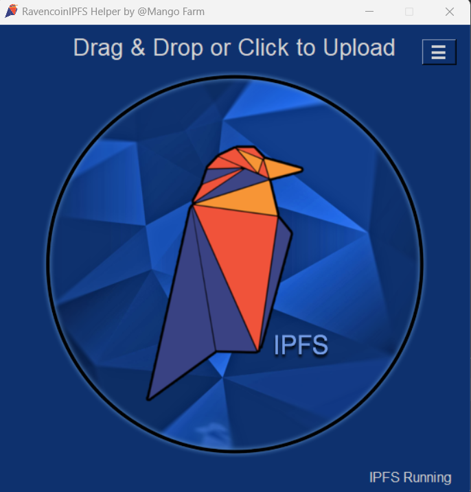
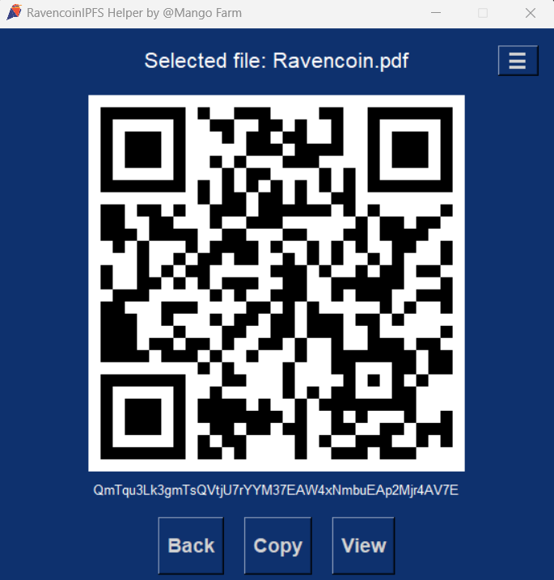
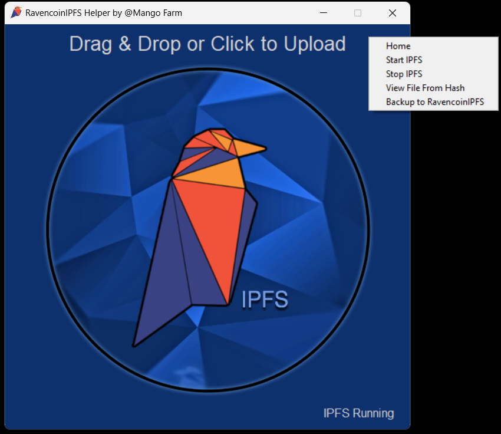

# RavencoinIPFS Helper

RavencoinIPFS Helper is a drag and drop IPFS helper tool specifically designed for Ravencoin. It allows you to easily upload files to IPFS and obtain the corresponding IPFS hash.

## Prerequisites

Before you can use RavencoinIPFS Helper, you need to install the following:

1. **Python 3:** Make sure you have Python 3 installed on your system. If you don't have it, you can download it from the official Python website: [Python Downloads](https://www.python.org/downloads/).

2. **IPFS:** Download and install IPFS on your machine. We recommend using ipfs-update for managing IPFS updates. You can find pre-built binaries for IPFS on the [IPFS Distribution page](https://dist.ipfs.tech/#ipfs-update) and the source code on the [IPFS GitHub repository](https://github.com/ipfs/ipfs-update).

## RavencoinIPFS Helper Installation

On Windows, you can use the executable file in [Releases](https://github.com/MangoFarmAssets/RavencoinIPFS-Helper/releases) to try out the RavencoinIPFS Helper.

To build from the RavencoinIPFS_Helper repository, follow these steps:

1. Clone the repository to your local machine using the following command:

    ```
    git clone https://github.com/MangoFarmAssets/RavencoinIPFS_Helper
    ```

2. Navigate to the cloned repository and install the required dependencies with the following command:

    ```
    pip install -r requirements.txt
    ```

3. Run the script by executing the following command in the repository's directory:

    ```
    python ipfs_helper.py
    ```

## How to Use

1. **Drag and Drop:** You can drag and drop files onto the application window to upload them to IPFS. Alternatively, you can click on the window to open a file dialog and select the files you want to upload.



2. **View and Copy Files:** After uploading a file, you can click on the "View" button to open the file using the default application associated with its file type.  Click on the "Copy" button to copy the IPFS hash of the uploaded file to your clipboard.



3. **Hamburger Menu:** Click on the hamburger menu button (☰) to access additional options, including starting and stopping the IPFS daemon, and viewing a file using its IPFS hash.  Backing up files to RavencoinIPFS is coming soon.



4. **IPFS Status:** The application displays the current status of the IPFS daemon. If the IPFS daemon is not running, you can start it from the hamburger menu.


***Coming soon:*** Backup to RavencoinIPFS, which will allow you to perform a one-click backup of your files to RavencoinIPFS.

## Troubleshooting

If you encounter any issues or errors while using RavencoinIPFS Helper, try the following troubleshooting steps:

1. Make sure you have IPFS installed and running. Check that IPFS is in your PATH and accessible from the command line.

2. Ensure that you have Python 3 installed and that it is accessible from the command line.

3. Verify that you have all the required dependencies installed by running the following command and ensuring the required packages are listed (see [requirements.txt)](./requirements.txt):

    ```
    pip list
    ```

This is very much a work in progress.  Enjoy!
